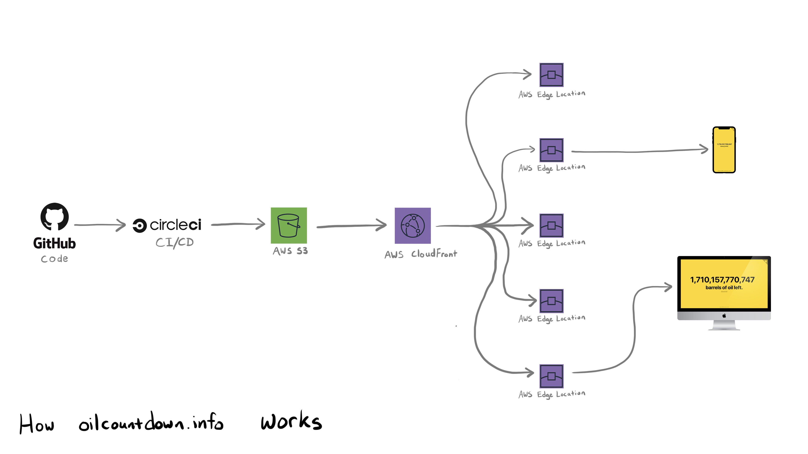

<h2 align="center"><b><a href="https://oilcountdown.info">https://oilcountdown.info</a></h2>

  <
  
  

## What it is?

Oil Countdown is a simple React web app that counts down the oil left on Earth using data from [BP](https://www.bp.com/) and [U.S. Energy Information Administration’s (EIA)](https://www.eia.gov/).

## How's it work?

## Want to Contribute?
Rad, thanks! Check out the [contributing guide](./CONTRIBUTING.md).

## CHANGELOG
[oil-countdown changelog](./CHANGELOG.md)

Made with :heart:, JavaScript, and GitHub.
